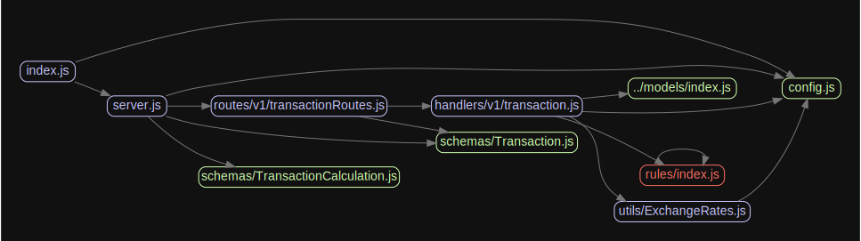

# Shop API

## Prebuild

- Copy `.env.example` to `.env`
- Change `DB` configs in the `.env` like `config/config.json` development DB name

## Build

### With npm

- Run `npm ci` to install packages
- Create DB by configs `npx sequelize db:migrate`

### Docker

- To start containers `docker-compose up --build`

## Develop

- Migrate DB `npx sequelize-cli db:migrate`
- Fill db with seed `npx sequelize db:seed:all`
- Run `npm run dev` development

### Add new rule

- Add file in the directory `src/rules/`. Name pattern `rule-*.js`

    File example :
    ```javascript 
    const BaseRule = require('./base/BaseRule');
    
    class CheckRule extends BaseRule {
      calculate() {
        // Rule context to calculate new rule
  
        // 
        retrun discount;
      }
    }
    module.exports = CheckRule;
  ```
- Use extend base rule in path `src/rules/BaseRule`


### Add new route

- Add to script `src/routes/v1/MODEL_NAME.js` new route
- Create new schemaOpt to this route `src/schemas/routerSchemas.js`
- Create new handler `src/hanlers/v1/MODEL_NAME.js` to handler in the schemaOpt

## Documentation (OpenAPI)

Visit [Docs](http://localhost:3000/docs)

## Project graph (build with [madge](https://www.npmjs.com/package/madge))



## Test

- Run `npm run test` run tests
